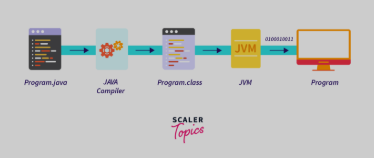

# *Maratona-Java*

## 01 - COMPILADOR JAVA

O processo de compilação do Java envolve os seguintes passos:  

- O programador escreve o código-fonte em um editor de código
- O compilador Java lê o código-fonte
- O compilador Java analisa o código-fonte
- O compilador Java traduz o código-fonte para bytecode
- O bytecode é processado pela Java Virtual Machine (JVM)

## 02 - TIPOS PRIMITIVOS

Os tipos primitivos em Java são os tipos de dados básicos que representam valores numéricos, caracteres e booleanos. São
chamados de primitivos porque são valores simples que não são objetos e ocupam um espaço fixo na memória.

Os tipos primitivos em Java são:  

- byte
- short
- int
- long
- boolean
- char
- float
- double.

## 03 - OPERADORES

Os operadores em Java são símbolos que instruem o compilador a realizar operações em variáveis e valores. Eles são
usados para manipular dados e variáveis em expressões.

Existem vários tipos de operadores em Java, como aritméticos, lógicos e relacionais.

Operadores aritméticos :

- Operador de adição (+)
- Operador de subtração (-)
- Operador de multiplicação (*)
- Operador de divisão (/)
- Operador de módulo (%).

Operadores lógicos :

- Operador E lógico, que retorna verdadeiro se ambas as expressões forem verdadeiras(&&)
- Operador OU, que retorna verdadeiro se uma ou ambas as expressões forem verdadeiras(||)
- Operador de Negação inverte valores booleanos, ou seja, se um valor for verdadeiro, ele se transforma em falso, e
  vice-versa(!)

Operadores Relacionais
Igual a (==):

- Verifica se dois valores são iguais.

Diferente de (!=):

- Verifica se dois valores são diferentes.

Maior que (>):

- Verifica se o valor da esquerda é maior que o valor da direita.

Menor que (<):

- Verifica se o valor da esquerda é menor que o valor da direita.

Maior ou igual a (>=):

- Verifica se o valor da esquerda é maior ou igual ao valor da direita.

Menor ou igual a (<=):

- Verifica se o valor da esquerda é menor ou igual ao valor da direita.

## 04 - ESTRUTURAS CONDICIONAIS

1. *if* : Executa um bloco de código se uma condição for verdadeira
2. *if-else* : Executa um bloco de código se a condição for verdadeira e outro bloco se for falsa.
3. *else-if* : Permite testar múltiplas condições em sequência.
4. Operador Ternário *(? :)* : Uma forma compacta de escrever uma condição if-else.
5. switch-case: Usado para comparar uma variável com múltiplos valores possíveis.

Observações:

- Use if para condições simples.
- Use switch para múltiplas comparações de valores.
- O operador ternário é útil para atribuições condicionais simples.

## 05 - ESTRUTURAS DE REPETIÇÕES

1. FOR

- Usado quando o número de repetição é

2. WHILE

- Repete um bloco de código enquanto uma condição for verdadeira.

3. DO-WHILE

- Similar ao while, mas o bloco de código é executado pelo menos uma vez, mesmo que a condição seja falsa.